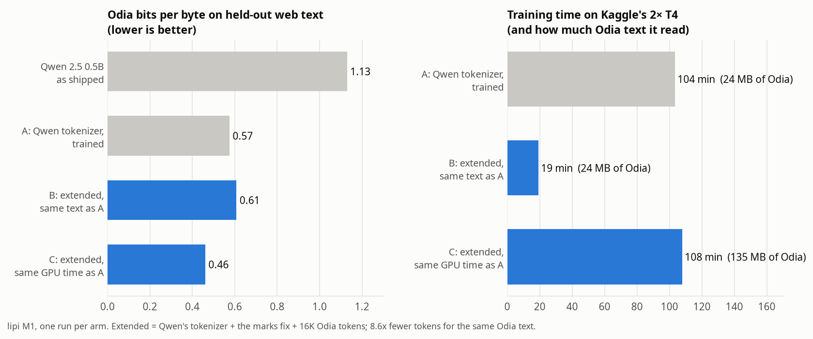
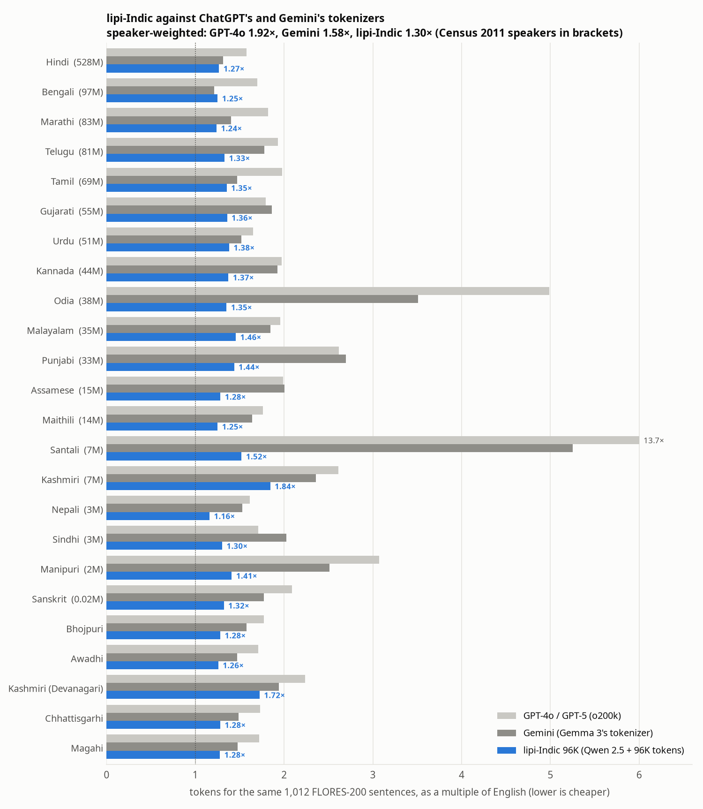

# lipi

**The token tax on Indian languages, measured and then fixed.** A language model reads and
writes in tokens, and it is priced, timed and limited in tokens. The same sentence costs far
more tokens in an Indian language than in English, so Indian users pay more per answer, wait
longer for it, and fit less of their text in the model's memory. lipi measures that tax for
every Indian language in FLORES-200 across 15 tokenizers that ship with today's models, and
then removes it from an open model: one extended tokenizer, lipi-Indic, takes fewer tokens
than both GPT-4o's and Gemini's in 23 of the 24 languages, with a smaller vocabulary than
Gemini's (below).

*Lipi* (ଲିପି, लिपि, লিপি) means "script, writing" in Odia, Hindi and Bengali.


## What M0 found

The same 1,012 sentences (FLORES-200 devtest, professionally translated), counted by each
tokenizer and divided by the count for English (`results/m0/token_tax.csv`):


- **Odia pays the most of any major Indian language, on almost every model.** On GPT-4o the
  same text costs **5.0×** the tokens of English and **3.2×** the tokens of Hindi (1.57×). On
  Llama 4 it is **8.4×** (Hindi: 1.65×), on Llama 3 **12.2×**, on Qwen 3 **9.7×**. GPT-4o cuts
  **53%** of Odia letters into pieces; on Llama 3, **99%** of the tokens it produces for Odia
  are not even whole characters but fragments of their bytes.
- **Two Indian models inherit the worst Odia tax measured.** Krutrim-2 (Ola) and Sarvam-M
  (Sarvam AI) ship Mistral's Tekken tokenizer: Krutrim-2's tokenizer file is byte-identical to
  Mistral NeMo's, and Sarvam-M's gives the same token counts in every language. Odia costs **12.9×**
  English there, **7.2×** Hindi; a single letter (ର୍ତ୍ତ) takes 15 tokens, one per byte.
- **There are two different causes, and some tokenizers have both.** Before a tokenizer uses
  its vocabulary, a regular expression cuts the text into pieces, and no token can span two
  pieces. The expression in GPT-4's, Llama 3's and Qwen's tokenizers matches letters
  (`\p{L}`) but not combining marks (`\p{M}`), and every Indian vowel sign and virama is a
  combining mark: କହିଛନ୍ତି ("has said") is cut into କହ · ିଛନ · ୍ତ · ି before the vocabulary
  is consulted. However large their vocabulary, these tokenizers cannot write Odia in fewer
  than **2.33×** the tokens of English, Hindi in fewer than 2.37×, Tamil in fewer than
  2.66×. GPT-4o, Llama 4, DeepSeek-V3 and Mistral's Tekken match marks as part of words
  (their floor for Odia is 0.84–0.85× English), so their tax is the other cause: a vocabulary
  with few Odia tokens. Tekken shows it in pure form: a floor of 0.84× and a tax of 12.9×.
- **Santali, in its own Ol Chiki script, is the most expensive language measured**: 13.7× on
  GPT-4o (worse than GPT-4's 12.7×), 12.4× on Mistral, 11.8× even on Sarvam-1. 7.4 million
  people speak it.
- **Weighted by speakers** (Census 2011, 1.16 billion people across the languages measured),
  the average Indian's text costs **1.9×** English on GPT-4o, **2.4×** on Llama 4, **4.8×** on
  Llama 3 and **5.3×** on Qwen 3. On Llama 3 and Qwen 3 every language measured costs at
  least 2×.
- **It is fixable, and the fix is known to work for tokenization.** Tokenizers built with
  Indian languages in mind cost 1.1–1.5× English for the major languages: Sarvam-1, IndicBERT
  v2 (AI4Bharat), BLOOM, NLLB-200. Gemma 3, with a 262K vocabulary, is the best of the
  general-purpose models (1.2–2.7×, except Odia at 3.5× and Santali at 5.3×). What a better tokenizer does to a model's
  speed and quality is what M1 and M2 measure.
- **A tokenizer's own blind spots show.** Sarvam-1, the best tokenizer here for Odia (1.46×),
  costs 7.4× for Urdu and 6.8× for Sindhi, scripts outside the ten languages it was built for.


### How it is measured

- **Text**: FLORES-200 devtest (Meta, CC BY-SA 4.0), the same 1,012 sentences in English and
  every Indian language it has: 19 of the 22 languages of the Eighth Schedule (Bodo, Dogri and
  Konkani are not in FLORES-200; IN22, which has all 22, needs a Hugging Face login and is
  next), Kashmiri in both its scripts, and Awadhi, Bhojpuri, Chhattisgarhi and Magahi.
- **Tokenizers** (`lipi/tokenizers.py`), each pinned to a commit: GPT-4o (`o200k_base`, also
  gpt-oss), GPT-4 (`cl100k_base`, also Phi-4), Llama 3, Llama 4, Gemma 3, Qwen 3, DeepSeek-V3,
  Mistral 7B v0.3, Mistral NeMo (Tekken), Krutrim-2, Sarvam-M, Sarvam-1, BLOOM, NLLB-200 and
  IndicBERT v2. Llama, Gemma and Mistral NeMo come from ungated re-uploads of the official
  files. That Phi-4 and gpt-oss tokenize like `cl100k_base` and `o200k_base` was checked on
  50 Odia sentences each.
- **Token tax**: tokens for the 1,012 sentences in a language / tokens for the same sentences
  in English, with no special tokens. Price, generation time and the share of a context
  window all scale with it.
- **Letters**: extended grapheme clusters (Unicode `\X`), which keep a conjunct such as ସ୍ତ୍ରୀ
  together as one letter, the way a reader sees it.
- **Floor**: the number of pieces the pre-tokenizer's regular expression cuts the text into
  (`Tokenizer.floor`), the fewest tokens any vocabulary could reach; reported for the
  byte-level and tiktoken tokenizers, whose pre-tokenizers do the cutting.
- **Broken letters / byte fragments**: from the exact bytes of every token, checked to
  concatenate back to the sentence (allowing for SentencePiece's leading space and the
  Unicode normalisation Qwen and NLLB apply). Every tokenizer passes on every sentence except
  NLLB-200, whose `<unk>` tokens and text rewriting leave 54–99% of sentences checkable; its
  byte measures cover those only. IndicBERT v2 (WordPiece) has no byte mapping; only its
  counts are used.
- **Speakers**: Census of India 2011, scheduled languages (Kashmiri counted once).

### Limits

- Token counts are not the whole cost: a tokenizer that splits Odia into bytes may also make
  the model worse at Odia, which M0 does not measure; M1 does.
- FLORES-200 is formal, translated news and travel text. Conversation, code-mixed Hinglish or
  romanised Indian languages will tax differently.
- The tax is relative to English on these sentences. Prices per token differ between providers;
  the multiple applies to whatever the price is.
- Measuring tokenizer unfairness is not new (Petrov et al., *Language Model Tokenizers
  Introduce Unfairness Between Languages*, NeurIPS 2023; Ahia et al., *Do All Languages Cost
  the Same?*, EMNLP 2023). lipi's part is current models, every Indian language FLORES-200
  has, letters that tokenizers break, and then the fix with its effect on speed and quality.

## M1: the fix

### Tokenizer

Both causes, removed from Qwen 2.5's tokenizer (`lipi/extend.py`, `scripts/extend_tokenizer.py`):

1. **Marks.** The pre-tokenizer's expression lets a word run over its combining marks, as
   GPT-4o's does. Text without combining marks (English, code) is cut exactly as before.
2. **Vocabulary.** New merges are learned on 85 MB of Odia web text (FineWeb-2, 20,000
   documents; none contain a FLORES sentence) by continuing BPE from Qwen's own segmentation,
   and appended after Qwen's 151,387 merges. Every new token contains the first two bytes
   of an Odia character (E0 AC or E0 AD), which no other script's UTF-8 does, so the new
   merges cannot fire on any other text: all 24 other languages keep exactly the same ids.

On FLORES-200 devtest (held out), tokens as a multiple of English (`results/m1/tokenizer.json`):

| Qwen 2.5 tokenizer | new tokens | Odia | Hindi | English |
|---|---|---|---|---|
| as shipped | 0 | 9.70× | 4.42× | 1× |
| marks fix only | 0 | 9.70× | 4.42× | 1× (same tokens) |
| new Odia tokens only | 1K / 4K / 16K | 2.53× / 2.38× / **2.34×** | 4.42× (same ids) | 1× (same ids) |
| **both** | 1K / 4K / **16K** / 32K | 1.98× / 1.44× / **1.13×** / 1.04× | 4.42× | 1× (same tokens) |

New tokens alone stop at the pre-tokenizer's floor (2.33×, from M0); the marks fix alone does
nothing, because the vocabulary has no Odia words to use it with. Together they take Odia
from 9.70× English to **1.13×** with 16K new tokens (8.6× fewer tokens for the same text) and
1.04× with 32K. The marks fix changes the ids of 18 other languages (their words are no
longer cut at vowel signs) and lowers their token counts by at most 0.5% (Kashmiri in Perso-Arabic script: 0.46% fewer).
It also changes Thai, which lipi-Indic below avoids.

The 16K tokenizer is `results/m1/tokenizers/qwen25-odia-marks-vocab-16k.json`.

### Model

Fewer tokens help only if the model still understands the text. Qwen 2.5 0.5B gets the
extended vocabulary (each new token's embedding starts as the mean of the pieces it
replaces; `lipi/model.py`) and continued pre-training on Odia web text plus a quarter as much
English, so English is not forgotten. Three arms, everything else identical
(`scripts/train_m1.py`, `scripts/kaggle_m1.sh`; Kaggle's 2× T4, DDP with ZeRO-1, one run per
arm, `results/m1/kaggle-full-2026-10-09.txt`):

- **A**: Qwen's own tokenizer, on 24 MB of Odia and 6 MB of English: 19.9M tokens;
- **B**: the extended tokenizer, on the same 30 MB of text: 3.5M tokens;
- **C**: the extended tokenizer, for as many tokens as A (the same GPU time): 135 MB of Odia
  and 34 MB of English.

Only the new tokens' embedding rows learn at a high rate (5e-4); everything else, the
original embedding rows (which are also the output layer) included, at 5e-5. Measured on
text no arm trained on:

| | Qwen 2.5 0.5B | extended, untrained | A | B | C |
|---|---|---|---|---|---|
| tokens for the 1,012 Odia FLORES sentences | 267,893 | 31,211 | 267,893 | **31,211** | **31,211** |
| training time on 2× T4 | | | 104 min | **19 min** | 108 min |
| Odia bits per byte, FLORES devtest | 1.444 | 1.183 | 0.751 | 0.782 | **0.674** |
| Odia bits per byte, 500 held-out web documents | 1.130 | 1.103 | 0.575 | 0.608 | **0.461** |
| English bits per byte, FLORES devtest | **1.076** | 1.205 | 1.164 | 1.106 | 1.127 |
| Odia → English translation, chrF++ (200 sentences) | 16.0 | 11.3 | 0.0 | 15.4 | **24.8** |
| English → Odia translation, chrF++ (200 sentences) | 8.7 | 2.6 | **10.8** | 3.7 | 8.3 |
| Belebele reading comprehension, Odia (900 questions) | 30.6% | 23.0% | 29.2% | 31.3% | 30.1% |
| time to score Belebele in Odia | 382 s | 46 s | 385 s | **46 s** | **44 s** |



What the numbers show:

- **The same text, 5.4× cheaper to train on.** B reads exactly A's 30 MB in 19 minutes
  instead of 104, and ends within 4% of A's Odia bits per byte on FLORES (6% on web text),
  while forgetting less English (+2.8% bits per byte against A's +8.2%).
- **The same GPU time, a better model.** In A's 104 minutes the extended tokenizer reads
  5.6× as much Odia, and C beats A by 10% on FLORES and 20% on held-out web text. C also
  translates Odia into English better than the untrained model (chrF++ 24.8 against 16.0),
  while A's translations share almost nothing with the references (0.03). This run kept only
  five outputs per model, so why A fails is not yet checked; evaluations now keep them all.
- **Inference is 8.4× cheaper per Odia question.** Scoring the 900 Belebele questions in Odia
  takes 46 s instead of 382 s, because each question is 8.6× fewer tokens.
- **Even untrained, the extended model predicts Odia better** (1.18 bits per byte against
  1.44): starting each new token at the mean of its pieces already works.

What they do not show, or show against the fix:

- **Belebele does not move.** Every model scores 23–31% in Odia (chance is 25%; one standard
  error is 1.5 points). A 0.5B model cannot answer reading-comprehension questions in Odia
  with or without the fix, so this benchmark cannot tell the arms apart.
- **English → Odia translation got worse with the extended tokenizer** (8.3 and 3.7 against
  A's 10.8): with five examples in the prompt, B's and C's sample outputs copy the English
  sentence back instead of translating it. A small base model translating into a language it barely
  knows is fragile in every arm (the untrained model copies an example sentence instead);
  this needs instruction tuning, not a tokenizer, and is left as it is.
- **English is still worse than before training** in every arm (+2.8% to +8.2% bits per
  byte); 20% English in the mix limits the damage but does not prevent it.
- One run per arm, so differences of a few percent are within what a second seed could move.

## lipi-Indic: every Indian language, against ChatGPT and Gemini

M1 fixed one language. lipi-Indic applies the same two changes to Qwen 2.5's tokenizer once,
for all 24 Indian languages in FLORES-200 (`scripts/extend_indic.py`):

- The marks fix, but only for the Indian scripts' combining marks. Qwen's vocabulary
  already holds 1,735 tokens that join letters with combining marks. Qwen's own
  pre-tokenizer can never produce 1,667 of them, so their embeddings were never trained:
  those rows sit almost exactly at the mean row (cosine 0.94, against 0.38 for a random
  row). A fix allowing every mark would route Thai text into those dead rows, so lipi-Indic
  leaves every other script's marks alone.
- New merges, learned on the web text of FineWeb-2: 12–18 MB per language where there is
  that much, and all of it for Awadhi and Santali (10.8 MB each), Magahi (4.1 MB) and
  Kashmiri (1.3 and 1.8 MB): 22.8 million words, with every document that contains a
  FLORES sentence left out. Hindi gets no more text than Odia, so the big languages do not
  take all the new tokens. The new merges are confined to tokens that contain an Indian
  script's bytes.

Tokens for FLORES-200 devtest as a multiple of English, against the tokenizers behind
ChatGPT and Gemini. GPT-4o, GPT-4.1, o3 and GPT-5 all use `o200k_base` (tiktoken). Google
publishes no tokenizer for Gemini; third-party ports of it are reported to be the same
262,144-entry SentencePiece model as Gemma 3's, so the "Gemini" column is Gemma 3's tokenizer
(not checked against Google's `countTokens`):

| tokenizer | vocabulary | speaker-weighted tax, 24 Indian languages |
|---|---|---|
| Qwen 2.5 / Qwen 3, as shipped | 151,665 | 5.28× |
| GPT-4o / GPT-5 (`o200k_base`) | 200,019 | 1.92× |
| Sarvam-1 (Indian, 10 languages) | 68,096 | 1.60× |
| Gemini (Gemma 3's tokenizer) | 262,145 | 1.58× |
| lipi-Indic 16K / 32K / 64K | 167,665 / 183,665 / 215,665 | 1.74× / 1.54× / 1.38× |
| **lipi-Indic 96K** | **247,665** | **1.30×** |
| lipi-Indic 128K | 279,665 | 1.26× |



**With a smaller vocabulary than Gemini's, lipi-Indic 96K takes fewer tokens than both
GPT-4o's and Gemini's tokenizers in 23 of the 24 languages.** The exception is Bengali, where
Gemini's 1.21× beats lipi-Indic's 1.25×. The largest gaps are in the languages today's models
serve worst:

- Odia: 1.35×, against GPT-4o's 4.99× and Gemini's 3.51×.
- Santali: 1.52×, against 13.70× and 5.25×.
- Punjabi: 1.44×, against 2.62× and 2.69×.
- Manipuri: 1.41×, against 3.07× and 2.51×.

| language | speakers (M) | Qwen 2.5 | GPT-4o / GPT-5 | Gemini | **lipi-Indic 96K** | Sarvam-1 |
|---|---|---|---|---|---|---|
| Hindi | 528.35 | 4.42× | 1.57× | 1.31× | **1.27×** | 1.14× |
| Bengali | 97.24 | 5.03× | 1.70× | 1.21× | 1.25× | 1.28× |
| Marathi | 83.03 | 4.62× | 1.82× | 1.40× | **1.24×** | 1.08× |
| Telugu | 81.13 | 6.99× | 1.93× | 1.78× | **1.33×** | 1.15× |
| Tamil | 69.03 | 6.11× | 1.98× | 1.47× | **1.35×** | 1.16× |
| Gujarati | 55.49 | 6.74× | 1.79× | 1.86× | **1.36×** | 1.20× |
| Urdu | 50.77 | 3.15× | 1.65× | 1.52× | **1.38×** | 7.39× |
| Kannada | 43.71 | 6.92× | 1.97× | 1.93× | **1.37×** | 1.22× |
| Odia | 37.52 | 9.70× | 4.99× | 3.51× | **1.35×** | 1.46× |
| Malayalam | 34.84 | 7.23× | 1.96× | 1.85× | **1.46×** | 1.36× |
| Punjabi | 33.12 | 7.28× | 2.62× | 2.69× | **1.44×** | 1.39× |
| Assamese | 15.31 | 5.39× | 1.99× | 2.01× | **1.28×** | 2.92× |
| Maithili | 13.58 | 4.39× | 1.76× | 1.64× | **1.25×** | 1.48× |
| Santali (Ol Chiki) | 7.37 | 8.92× | 13.70× | 5.25× | **1.52×** | 11.77× |
| Kashmiri (Perso-Arabic) | 6.80 | 3.47× | 2.61× | 2.36× | **1.84×** | 7.27× |
| Nepali | 2.93 | 4.42× | 1.61× | 1.53× | **1.16×** | 1.54× |
| Sindhi (Perso-Arabic) | 2.77 | 2.85× | 1.71× | 2.02× | **1.30×** | 6.76× |
| Manipuri (Bengali script) | 1.76 | 5.61× | 3.07× | 2.51× | **1.41×** | 2.64× |
| Sanskrit | 0.02 | 4.51× | 2.09× | 1.77× | **1.32×** | 1.61× |
| Bhojpuri | | 4.30× | 1.77× | 1.57× | **1.28×** | 1.40× |
| Awadhi | | 4.30× | 1.71× | 1.47× | **1.26×** | 1.29× |
| Kashmiri (Devanagari) | | 4.37× | 2.23× | 1.94× | **1.72×** | 1.95× |
| Chhattisgarhi | | 4.21× | 1.73× | 1.49× | **1.28×** | 1.29× |
| Magahi | | 4.19× | 1.72× | 1.48× | **1.28×** | 1.30× |

(The census counts Bhojpuri, Awadhi, Chhattisgarhi and Magahi speakers under Hindi.)

Read it with care:

- **Sarvam-1 is better than lipi-Indic for the ten languages it was built for.** Examples:
  Hindi 1.14×, Marathi 1.08×, Tamil 1.16×. It has a much smaller vocabulary (68K) spent
  almost only on those languages. It fails on the rest: Urdu 7.39×, Sindhi 6.76×,
  Santali 11.77×. lipi-Indic covers all 24 and keeps every other language Qwen already
  handles.
- **Other languages.** English, French, Spanish, Russian, Chinese, Japanese, Korean, Thai
  and Hebrew keep exactly the ids Qwen gives them. Arabic and Persian change, because Urdu,
  Kashmiri and Sindhi share their script and the new Urdu tokens fire on them too. Both get
  cheaper: Arabic 1.63× → 1.54×, Persian 2.58× → 1.79×. Those tokens were learned on Urdu,
  so a model trained only on Indian text would not yet know them in Arabic or Persian.
- **These are token counts, not a trained model.** M1 trained Qwen 2.5 0.5B on the Odia-only
  tokenizer. Training on lipi-Indic needs all 24 languages' text and is the next step.
- **Token counts are not prices.** Every API sets its own price per token. A token count
  says how much text fits in a context window, and how many steps a model takes to write it.
  M2 times those steps.

The 64K and 96K tokenizers are `results/m1/tokenizers/qwen25-indic-{64k,96k}.json`, with the
measurements in `results/m1/indic.json`.

## M2: what the token tax costs in time, and what the fix gives back

Measured on one Kaggle T4 (fp16) with Qwen 2.5 0.5B: the time to write 40 FLORES devtest sentences per language, token by token, forced to the reference text so every tokenizer writes exactly the same words ([`scripts/speed_m2.py`](scripts/speed_m2.py), [raw results](results/m2/speed.json)). Speed does not depend on the weights, so the extended models are the untrained ones.

| Language | Qwen's tokenizer, s per sentence | lipi-Indic 96K | Speed-up (batch 1 / 16) | FLORES sentences in a 32K context: Qwen → lipi-Indic |
|---|---|---|---|---|
| English | 0.83 | 0.84 | 0.99× / 0.99× | >1,012 → >1,012 |
| Hindi | 3.73 | 1.12 | **3.3×** / 3.4× | 274 → 944 |
| Bengali | 4.33 | 1.08 | **4.0×** / 4.0× | 232 → 957 |
| Tamil | 5.28 | 1.17 | **4.5×** / 4.0× | 192 → 876 |
| Telugu | 5.89 | 1.13 | **5.2×** / 4.4× | 166 → 896 |
| Odia | 8.37 | 1.19 | **7.0×** / 6.7× | 116 → 881 |
| Urdu | 2.71 | 1.20 | **2.3×** / 2.2× | 380 → 860 |
| Santali (Ol Chiki) | 6.91 | 1.28 | **5.4×** / 5.7× | 134 → 778 |

- **Each token costs the same** (26.4–27.4 ms on every tokenizer, so the larger vocabulary does not slow the model down); what changes is how many tokens the same sentence needs. With Qwen's tokenizer, an Odia sentence takes 10× as long to write as an English one; with lipi-Indic, 1.4×.
- The Odia-only tokenizer (lipi-odia-16k) writes Odia faster still (0.99 s per sentence, **8.5×**) but leaves the other languages where they were (0.98–1.01×).
- **Reading a long Odia document** (3,000 characters, the prefill before the first answer token): Qwen's tokenizer needs 5,923 tokens and 3.40 s; lipi-odia-16k 618 tokens and 0.068 s (**50×**); lipi-Indic 650 tokens and 0.088 s (39×). Prefill grows faster than linearly with length, so cutting tokens 9.6× saves more than 9.6× the time.
- Limits: one GPU, one model size, forced decoding of reference sentences (real answers differ in length), 40 sentences per language; the context figures count all 1,012 FLORES devtest sentences.

## Plan

| | Milestone | State |
|---|---|---|
| M0 | Measure the token tax: 24 Indian languages × 15 tokenizers; tokens, letters broken, byte fragments, the pre-tokenizer's floor; charts | done |
| M1 | Fix it in an open model: train Indic tokens, extend a small model's vocabulary (Qwen 2.5), initialise and train the new embeddings on Kaggle's 2× T4; measure tokens saved and quality (bits per byte, translation, comprehension) before and after | done (one run per arm) |
| M1b | lipi-Indic: one tokenizer for all 24 Indian languages, against GPT-4o / GPT-5 and Gemini | done (tokenizer); model training next |
| M2 | Speed end to end: time to write the same sentences and how much text fits in the context window, per language, before and after, on a T4 (`scripts/speed_m2.py`) | done |
| M3 | An interactive token-tax page (type a sentence, see each model's tokens and cost), all 22 scheduled languages with IN22, write-up | |

## Run it

```
pip install tokenizers tiktoken regex matplotlib pytest
python scripts/token_tax.py          # all tokenizers x 25 languages (about 2 minutes on 4 CPUs)
python scripts/charts.py             # the charts above
CHROME=/path/to/chrome python scripts/show_sentence.py 0    # the sentence picture
python -m pytest tests               # LIPI_ALL_TOKENIZERS=1 also round-trips every tokenizer
```

FLORES-200 and the tokenizers download on first use into `~/.cache/lipi` (`LIPI_CACHE`).
