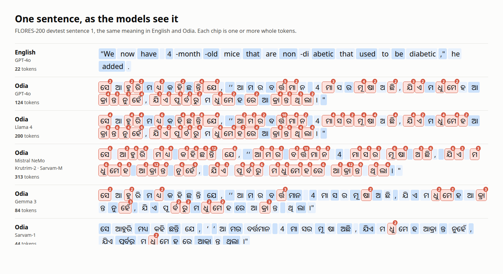
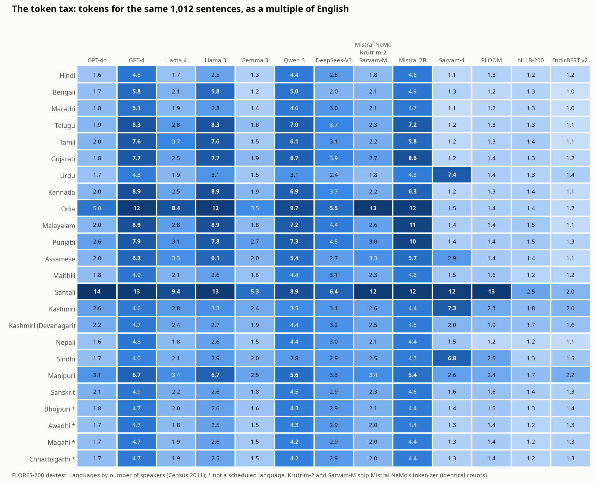
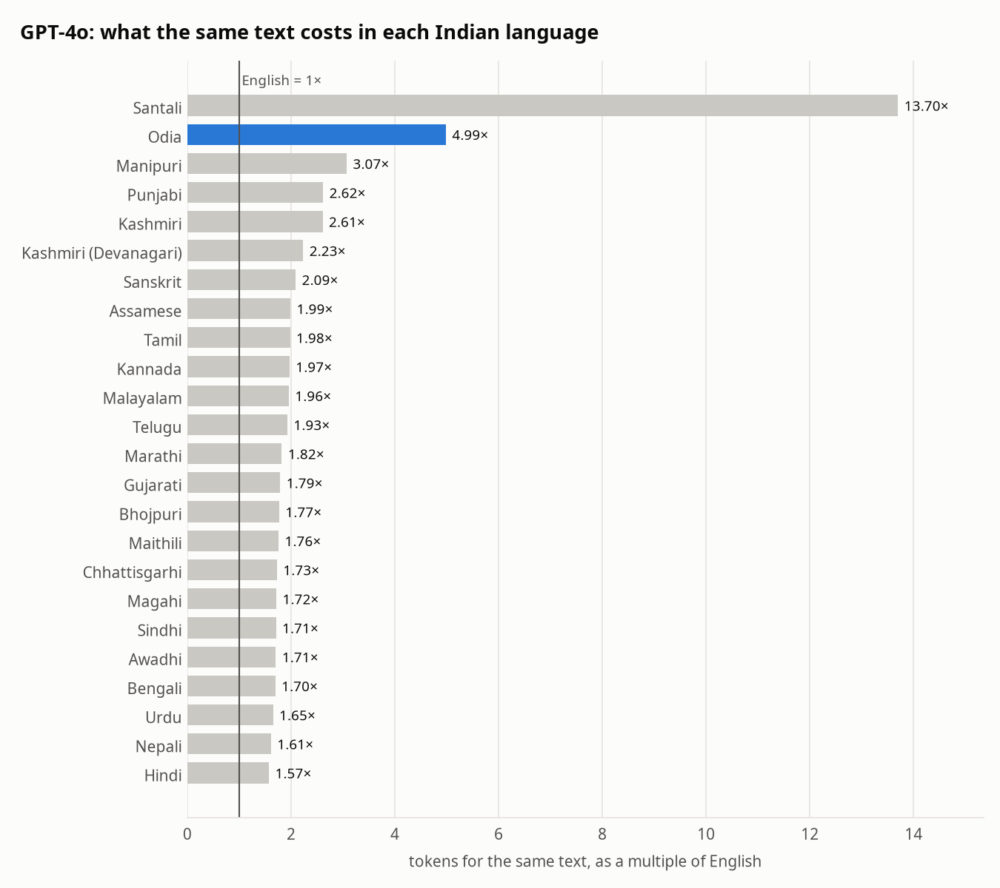

# lipi

**The token tax on Indian languages, measured and then fixed.** A language model reads and
writes in tokens, and it is priced, timed and limited in tokens. The same sentence costs far
more tokens in an Indian language than in English, so Indian users pay more per answer, wait
longer for it, and fit less of their text in the model's memory. lipi measures that tax for
every Indian language in FLORES-200 across 15 tokenizers that ship with today's models, and
then works to remove it from an open model (the plan is below).

*Lipi* (ଲିପି, लिपि, লিপি) means "script, writing" in Odia, Hindi and Bengali.



## What M0 found

The same 1,012 sentences (FLORES-200 devtest, professionally translated), counted by each
tokenizer and divided by the count for English (`results/m0/token_tax.csv`):



- **Odia pays the most of any major Indian language, on almost every model.** On GPT-4o the
  same text costs **5.0×** the tokens of English and **3.2×** the tokens of Hindi (1.57×). On
  Llama 4 it is **8.4×** (Hindi: 1.65×), on Llama 3 **12.2×**, on Qwen 3 **9.7×**. GPT-4o cuts
  **53%** of Odia letters into pieces; on Llama 3, **99%** of the tokens it produces for Odia
  are not even whole characters but fragments of their bytes.
- **Two Indian models inherit the worst Odia tax measured.** Krutrim-2 (Ola) and Sarvam-M
  (Sarvam AI) ship Mistral's Tekken tokenizer: Krutrim-2's tokenizer file is byte-identical to
  Mistral NeMo's, and Sarvam-M's gives the same token counts in every language. Odia costs **12.9×**
  English there, **7.2×** Hindi; a single letter (ର୍ତ୍ତ) takes 15 tokens, one per byte.
- **Santali, in its own Ol Chiki script, is the most expensive language measured**: 13.7× on
  GPT-4o (worse than GPT-4's 12.7×), 12.4× on Mistral, 11.8× even on Sarvam-1. 7.4 million
  people speak it.
- **Weighted by speakers** (Census 2011, 1.16 billion people across the languages measured),
  the average Indian's text costs **1.9×** English on GPT-4o, **2.4×** on Llama 4, **4.8×** on
  Llama 3 and **5.3×** on Qwen 3. On Llama 3 and Qwen 3 every language measured costs at
  least 2×.
- **It is fixable, and the fix is known to work for tokenization.** Tokenizers built with
  Indian languages in mind cost 1.1–1.5× English for the major languages: Sarvam-1, IndicBERT
  v2 (AI4Bharat), BLOOM, NLLB-200. Gemma 3, with a 262K vocabulary, is the best of the
  general-purpose models (1.2–2.7×, except Odia at 3.5× and Santali at 5.3×). What a better tokenizer does to a model's
  speed and quality is what M1 and M2 measure.
- **A tokenizer's own blind spots show.** Sarvam-1, the best tokenizer here for Odia (1.46×),
  costs 7.4× for Urdu and 6.8× for Sindhi, scripts outside the ten languages it was built for.



### How it is measured

- **Text**: FLORES-200 devtest (Meta, CC BY-SA 4.0), the same 1,012 sentences in English and
  every Indian language it has: 19 of the 22 languages of the Eighth Schedule (Bodo, Dogri and
  Konkani are not in FLORES-200; IN22, which has all 22, needs a Hugging Face login and is
  next), Kashmiri in both its scripts, and Awadhi, Bhojpuri, Chhattisgarhi and Magahi.
- **Tokenizers** (`lipi/tokenizers.py`), each pinned to a commit: GPT-4o (`o200k_base`, also
  gpt-oss), GPT-4 (`cl100k_base`, also Phi-4), Llama 3, Llama 4, Gemma 3, Qwen 3, DeepSeek-V3,
  Mistral 7B v0.3, Mistral NeMo (Tekken), Krutrim-2, Sarvam-M, Sarvam-1, BLOOM, NLLB-200 and
  IndicBERT v2. Llama, Gemma and Mistral NeMo come from ungated re-uploads of the official
  files. That Phi-4 and gpt-oss tokenize like `cl100k_base` and `o200k_base` was checked on
  50 Odia sentences each.
- **Token tax**: tokens for the 1,012 sentences in a language / tokens for the same sentences
  in English, with no special tokens. Price, generation time and the share of a context
  window all scale with it.
- **Letters**: extended grapheme clusters (Unicode `\X`), which keep a conjunct such as ସ୍ତ୍ରୀ
  together as one letter, the way a reader sees it.
- **Broken letters / byte fragments**: from the exact bytes of every token, checked to
  concatenate back to the sentence (allowing for SentencePiece's leading space and the
  Unicode normalisation Qwen and NLLB apply). Every tokenizer passes on every sentence except
  NLLB-200, whose `<unk>` tokens and text rewriting leave 54–99% of sentences checkable; its
  byte measures cover those only. IndicBERT v2 (WordPiece) has no byte mapping; only its
  counts are used.
- **Speakers**: Census of India 2011, scheduled languages (Kashmiri counted once).

### Limits

- Token counts are not the whole cost: a tokenizer that splits Odia into bytes may also make
  the model worse at Odia, which M0 does not measure; M1 does.
- FLORES-200 is formal, translated news and travel text. Conversation, code-mixed Hinglish or
  romanised Indian languages will tax differently.
- The tax is relative to English on these sentences. Prices per token differ between providers;
  the multiple applies to whatever the price is.
- Measuring tokenizer unfairness is not new (Petrov et al., *Language Model Tokenizers
  Introduce Unfairness Between Languages*, NeurIPS 2023; Ahia et al., *Do All Languages Cost
  the Same?*, EMNLP 2023). lipi's part is current models, every Indian language FLORES-200
  has, letters that tokenizers break, and then the fix with its effect on speed and quality.

## Plan

| | Milestone | State |
|---|---|---|
| M0 | Measure the token tax: 24 Indian languages × 15 tokenizers; tokens, letters broken, byte fragments; charts | done |
| M1 | Fix it in an open model: train Indic tokens, extend a small model's vocabulary (Qwen 2.5), initialise and train the new embeddings on Kaggle's 2× T4; measure tokens saved and quality (bits per byte, translation, comprehension) before and after | |
| M2 | Speed and cost end to end: time to answer and tokens per second per language before and after, on a T4; speculative decoding; cost per 1,000 answers | |
| M3 | An interactive token-tax page (type a sentence, see each model's tokens and cost), all 22 scheduled languages with IN22, write-up | |

## Run it

```
pip install tokenizers tiktoken regex matplotlib pytest
python scripts/token_tax.py          # all tokenizers x 25 languages (about 2 minutes on 4 CPUs)
python scripts/charts.py             # the charts above
CHROME=/path/to/chrome python scripts/show_sentence.py 0    # the sentence picture
python -m pytest tests               # LIPI_ALL_TOKENIZERS=1 also round-trips every tokenizer
```

FLORES-200 and the tokenizers download on first use into `~/.cache/lipi` (`LIPI_CACHE`).
